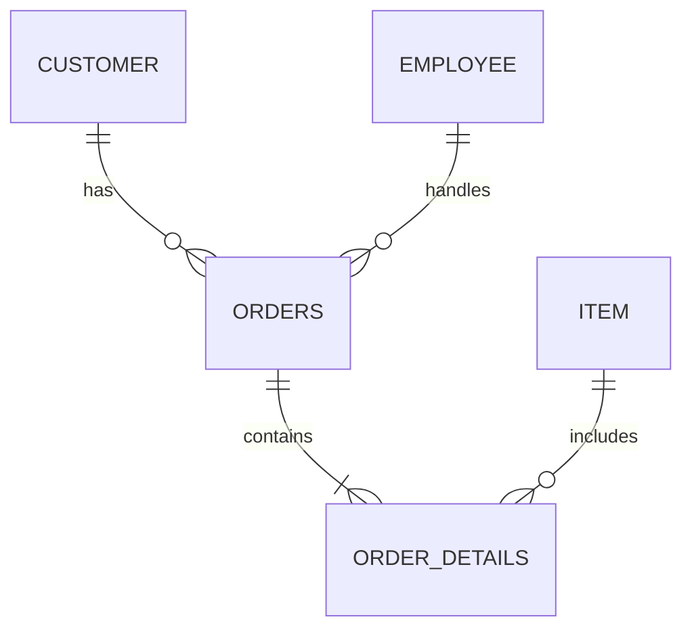

# テーブル定義書

このドキュメントは、販売支援システムの一部である得意先管理システムと得意先別集計システムで使用されるデータベースのテーブル定義をまとめたものです。

## 構造

| テーブル名 | 説明 |
| --- | --- |
| 得意先採番 | 得意先コードの採番情報を持つテーブル |
| 得意先 | 得意先情報を持つテーブル |
| 従業員 | 従業員情報を持つテーブル |
| 商品 | 商品情報と商品の在庫情報を持つテーブル |
| 受注 | 受注情報を持つテーブル |
| 受注明細 | 受注の明細情報を持つテーブル |

## 詳細

### 得意先採番

| フィールド名 | データ型 | 桁数 | 説明 |
| --- | --- | --- | --- |
| customer_code | INT | — | 最新の得意先コード（採番値） |

### 得意先

| フィールド名 | データ型 | 桁数 | 説明 |
| --- | --- | --- | --- |
| customer_code | VARCHAR | 6 | 得意先コード（PK） |
| customer_name | VARCHAR | 32 | 得意先名 |
| customer_telno | VARCHAR | 13 | 電話番号 |
| customer_postalcode | VARCHAR | 8 | 郵便番号 |
| customer_address | VARCHAR | 40 | 住所 |
| discount_rate | INT | — | 割引率 |
| delete_flag | INT | — | 削除フラグ |

### 従業員

| フィールド名 | データ型 | 桁数 | 説明 |
| --- | --- | --- | --- |
| employee_no | VARCHAR | 6 | 従業員番号（PK） |
| employee_name | VARCHAR | 32 | 従業員名 |
| password | VARCHAR | 8 | パスワード |

### 商品

| フィールド名 | データ型 | 桁数 | 説明 |
| --- | --- | --- | --- |
| item_code | VARCHAR | 6 | 商品コード（PK） |
| item_name | VARCHAR | 32 | 商品名 |
| price | INT | — | 販売価格 |
| stock | INT | — | 在庫数 |

### 受注

| フィールド名 | データ型 | 桁数 | 説明 |
| --- | --- | --- | --- |
| order_no | VARCHAR | 6 | 受注番号（PK） |
| customer_code | VARCHAR | 6 | 得意先コード（FK: customer.customer_code） |
| employee_no | VARCHAR | 6 | 従業員番号（FK: employee.employee_no） |
| total_price | INT | — | 受注合計金額 |
| detail_num | INT | — | 明細件数 |
| deliver_date | DATE | — | 納品日 |
| order_date | DATE | — | 受注日 |

### 受注明細

| フィールド名 | データ型 | 桁数 | 説明 |
| --- | --- | --- | --- |
| order_no | VARCHAR | 6 | 受注番号（PKの一部／FK: orders.order_no） |
| item_code | VARCHAR | 6 | 商品コード（PKの一部／FK: item.item_code） |
| order_num | INT | — | 受注数量 |
| order_price | INT | — | 明細金額 |

備考: 受注明細は複合主キー（order_no, item_code）を持ちます。
