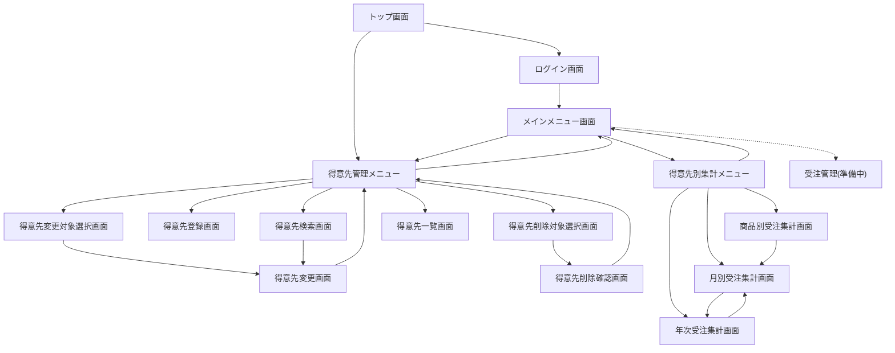

# 画面設計

このドキュメントは、販売支援システムの一部である得意先管理システムと得意先別集計システムの画面設計をまとめたものです。

## 基本方針

- 画面はシンプルで直感的に操作できるように設計します。
- 入力項目は必要最低限に抑え、ユーザーの負担を軽減します。
- モダンで一貫性のあるシンプルなデザインを採用し、ユーザーエクスペリエンスを向上させます。
- 各画面には適切なバリデーションを実装し、データの整合性を確保します。
- エラーメッセージは具体的で分かりやすくし、ユーザーが問題を迅速に解決できるようにします。
- レスポンシブデザインを採用し、様々なデバイスでの利用を可能にします。

## 画面一覧

| 名称 | 説明 |
| --- | --- |
| トップ画面 | システムのお知らせと導線を表示し、ログインや得意先メニューへ誘導します。|
| ログイン画面 | 従業員番号とパスワードでログインします。|
| メインメニュー画面 | ログイン後の起点として、得意先管理と得意先別集計カードを表示します。受注管理カードは準備中として無効化します。|
| 得意先管理メニュー画面 | 得意先管理の各機能へのリンクを一覧表示します。|
| 得意先別集計メニュー画面 | 月次・年次・商品別の集計画面へのリンクを表示します。|
| 得意先検索画面 | 得意先コードまたは得意先名で検索し、詳細カードまたは一覧を表示します。|
| 得意先登録画面 | 新規得意先を登録し、結果をカードで表示します。|
| 得意先変更対象選択画面 | 変更したい得意先を一覧から選択します。|
| 得意先変更画面 | 選択済み得意先の情報を編集します。|
| 得意先削除対象選択画面 | 削除したい得意先を一覧から選択します。|
| 得意先削除確認画面 | 削除対象の詳細を再表示し、削除を確定します。|
| 得意先一覧画面 | 登録済みの得意先を表形式で表示します。|
| 月別受注集計画面 | 指定年月の受注を得意先別に集計します。|
| 年次受注集計画面 | 指定年の受注を得意先別に集計します。|
| 商品別受注集計画面 | 得意先コードを指定して商品別の受注明細を集計します。|

※ 得意先別集計はメインメニューから「得意先別集計メニュー画面」を経由し、各集計画面へ遷移します。

## 画面遷移図

以下の図は主要画面間の遷移関係を示します。トップ画面やメニュー画面から各業務画面へ辿る際の導線を把握するために利用してください。

## 画面詳細

各画面の主要な入出力項目を示します。

### トップ画面

| 項目 | 説明 |
| --- | --- |
| タイトル | 販売支援システムの名称を表示します。|
| お知らせカード | システム概要やロードマップなどのメッセージをカード形式で表示します。|
| アクションボタン | ログイン画面と得意先管理メニューへのリンクを表示します。|

### ログイン画面

| 項目 | 説明 |
| --- | --- |
| タイトル | ログイン画面のタイトルを表示します。|
| 従業員番号 | 従業員番号の入力欄を表示します。|
| パスワード | パスワードの入力欄を表示します。|
| アクションボタン | ログイン実行とトップへ戻るボタンを表示します。|

### メインメニュー画面

| 項目 | 説明 |
| --- | --- |
| タイトル | メインメニューのタイトルを表示します。|
| 得意先管理カード | 得意先管理メニューへのリンクを表示します。|
| 受注管理カード | 準備中バッジを付与し、遷移を無効化したカードを表示します。|
| 得意先別集計カード | 月別受注集計画面へのリンクを表示します。|
| ログアウトボタン | ログアウト操作のリンクを表示します。|

### 得意先管理メニュー画面

| 項目 | 説明 |
| --- | --- |
| タイトル | 得意先管理メニューのタイトルを表示します。|
| メニューリスト | 検索、登録、削除、変更、一覧へのリンクを縦に並べて表示します。|
| 戻るボタン | メインメニュー画面へ戻るボタンを表示します。|

### 得意先別集計メニュー画面

| 項目 | 説明 |
| --- | --- |
| タイトル | 得意先別集計メニューのタイトルを表示します。|
| 集計カード | 月次・年次・商品別の各集計カードと説明文、遷移ボタンを表示します。|
| 戻るボタン | メインメニュー画面へ戻るボタンを表示します。|

### 得意先検索画面

| 項目 | 説明 |
| --- | --- |
| タイトル | 得意先検索のタイトルを表示します。|
| 得意先検索フォーム | 得意先コード（完全一致）と得意先名（部分一致）の入力欄、検索ボタンを表示します。|
| 検索結果カード | 検索結果が1件のときに得意先コード、名称、連絡先、住所、割引率を表示します。|
| 検索結果一覧 | 複数件ヒットしたときに得意先コード・名称・詳細表示ボタンを表形式で表示します。|
| メニューに戻るボタン | 得意先管理メニューへ戻るリンクを表示します。|

### 得意先登録画面

| 項目 | 説明 |
| --- | --- |
| タイトル | 得意先登録のタイトルを表示します。|
| 入力フォーム | 得意先名、電話番号、郵便番号、住所、割引率の入力欄を表示します。|
| アクションボタン | 登録実行と得意先管理メニューへ戻るボタンを表示します。|
| 登録結果カード | 登録が完了した得意先の詳細を表示します。|

### 得意先変更対象選択画面

| 項目 | 説明 |
| --- | --- |
| タイトル | 得意先変更のタイトルを表示します。|
| 得意先一覧テーブル | 得意先コード、得意先名、編集ボタン列を表示します。|
| 戻るボタン | 得意先管理メニューへ戻るボタンを表示します。|

### 得意先変更画面

| 項目 | 説明 |
| --- | --- |
| タイトル | 選択済み得意先の編集タイトルを表示します。|
| 入力フォーム | 得意先名、電話番号、郵便番号、住所、割引率の入力欄を表示します。|
| アクションボタン | 更新実行、別の得意先を選ぶ、得意先管理メニューへ戻るボタンを表示します。|
| 更新結果カード | 最新の得意先情報を表示します。|

### 得意先削除対象選択画面

| 項目 | 説明 |
| --- | --- |
| タイトル | 得意先削除のタイトルを表示します。|
| 得意先一覧テーブル | 得意先コード、得意先名、削除確認ボタン列を表示します。|
| 戻るボタン | 得意先管理メニューへ戻るボタンを表示します。|

### 得意先削除確認画面

| 項目 | 説明 |
| --- | --- |
| タイトル | 削除確認のタイトルを表示します。|
| 警告メッセージ | 削除が取り消せない旨を強調表示します。|
| 得意先詳細カード | 得意先コード、名称、連絡先、住所、割引率を表示します。|
| アクションボタン | 削除実行、一覧へ戻る、得意先管理メニューへ戻るボタンを表示します。|

### 得意先一覧画面

| 項目 | 説明 |
| --- | --- |
| タイトル | 得意先一覧のタイトルを表示します。|
| 得意先一覧テーブル | 得意先コード、得意先名、電話番号、郵便番号、住所、割引率を表示します。|
| 戻るボタン | 得意先管理メニューへ戻るボタンを表示します。|

### 月別受注集計画面

| 項目 | 説明 |
| --- | --- |
| タイトル | 月別受注集計のタイトルを表示します。|
| 検索フォーム | 集計年・月の入力欄と集計実行ボタンを表示します。|
| 集計結果テーブル | 得意先コード、得意先名、合計金額(税込)を表示します。|
| 総計カード | 全得意先の合計金額(税込)を表示します。|
| ナビゲーション | 年次受注集計画面へのリンクを表示します。|

### 年次受注集計画面

| 項目 | 説明 |
| --- | --- |
| タイトル | 年次受注集計のタイトルを表示します。|
| 検索フォーム | 集計年の入力欄と集計実行ボタンを表示します。|
| 集計結果テーブル | 得意先コード、得意先名、年間合計金額(税込)を表示します。|
| 総計カード | 全得意先の年間合計(税込)を表示します。|
| ナビゲーション | 月別受注集計画面へのリンクを表示します。|

### 商品別受注集計画面

| 項目 | 説明 |
| --- | --- |
| タイトル | 商品別受注集計のタイトルを表示します。|
| 検索フォーム | 得意先コードの入力欄と集計実行ボタンを表示します。|
| 得意先情報カード | 得意先名とコードを表示します。|
| 集計結果テーブル | 商品コード、商品名、合計数量、単価(税込)、合計金額(税込)を表示します。|
| 総計カード | 商品別合計の総計(税込)を表示します。|
| ナビゲーション | 月別受注集計画面へのリンクを表示します。|

