# 得意先管理の操作手順

本ドキュメントでは、得意先管理メニューに含まれる検索・登録・変更・削除・一覧機能の操作手順と画面遷移を説明します。仕様の詳細は[こちら](./../app/spec.md)を参照してください。

## メニューへ移動する
1. メインメニューから「得意先管理」を選択します。
   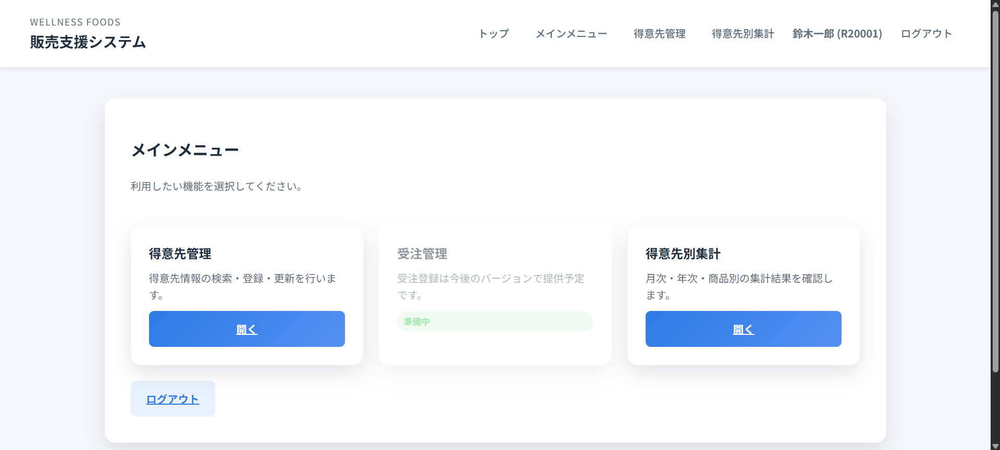
2. 得意先管理メニューに遷移し、必要な操作リンクをクリックします。
   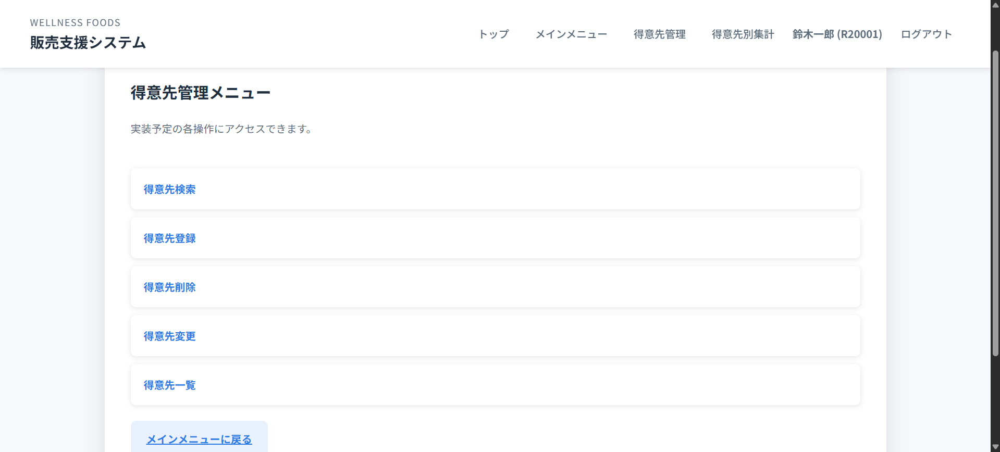

## 得意先検索
1. 「得意先検索」を選び、コードまたは名称を入力します。
   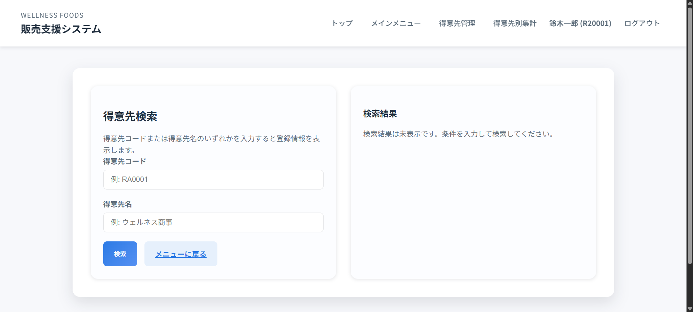
2. 条件が1件に絞られた場合は詳細カードが表示され、右下の「この得意先を変更」から更新画面へ遷移できます。
   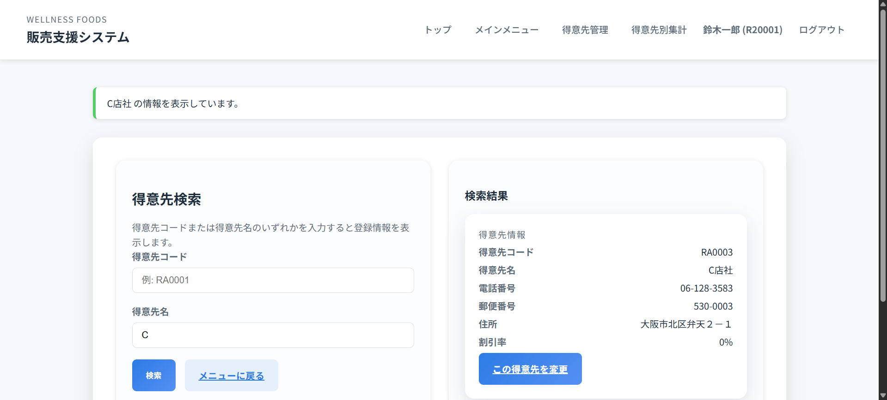
3. 複数件ヒットした場合は一覧が表示され、各行の「詳細表示」ボタンで個別の詳細へ移動します。
   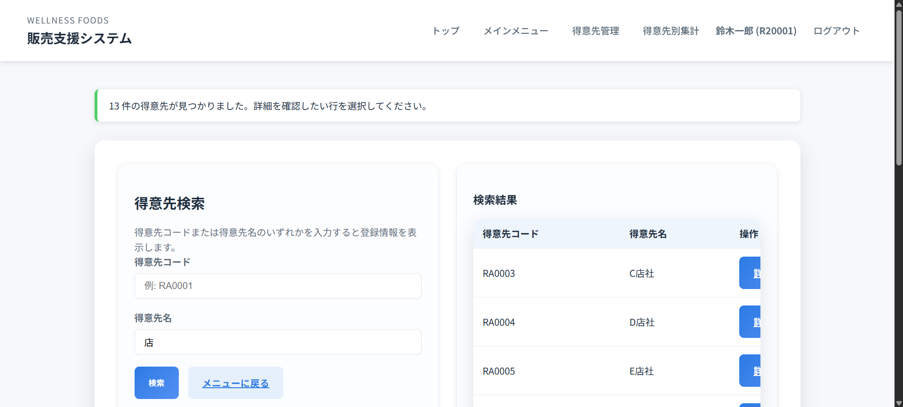

### 入力のコツ
- コード検索は完全一致です。誤入力時はフィールド下にエラーが表示されます。
- 名称検索は部分一致で、ひらがな・カタカナのゆらぎも吸収します。

## 得意先登録
1. 「得意先登録」を開き、各項目を入力します。
   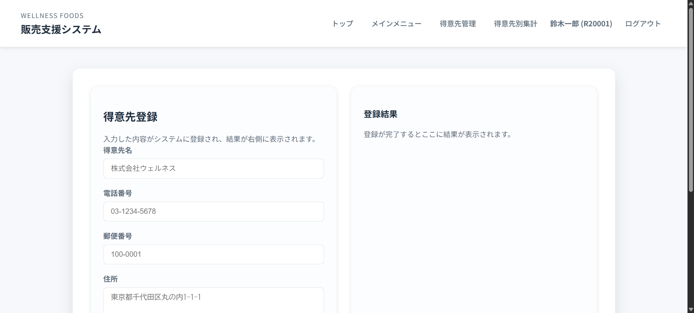
2. 登録ボタンを押すと右側に結果カードが表示され、採番された得意先コードを確認できます。
   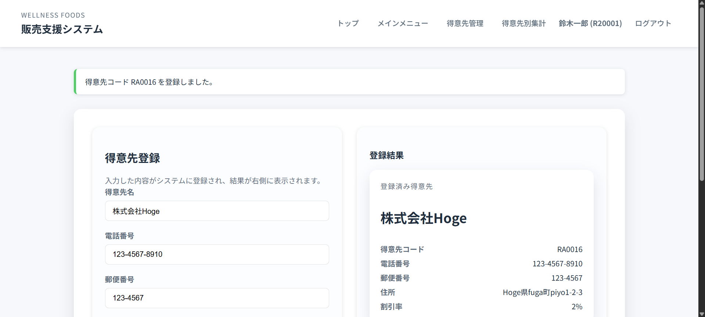

### 入力項目
| 項目 | 必須 | 補足 |
| --- | --- | --- |
| 得意先名 | 必須 | 32文字以内で入力します。 |
| 電話番号 | 必須 | ハイフン付きで入力できます。 |
| 郵便番号 | 必須 | 7桁（ハイフン可）。 |
| 住所 | 必須 | 最大40文字。 |
| 割引率 | 任意 | 未入力時は「-」として表示されます。 |

## 得意先変更
### 対象選択
1. 「得意先変更」を開くと、編集可能な得意先一覧が表示されます。
   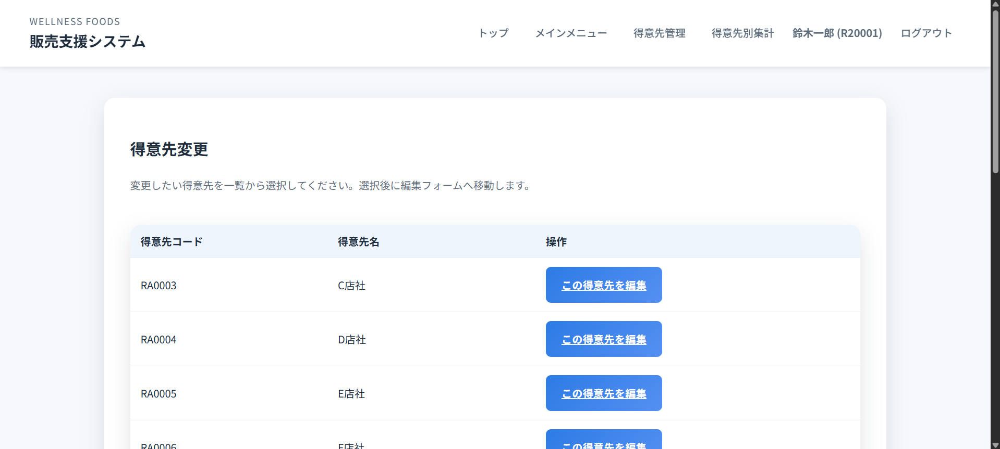
2. 編集したい行の「この得意先を編集」をクリックします。

### 情報更新
1. 編集フォームで内容を修正し、「更新」を押します。
   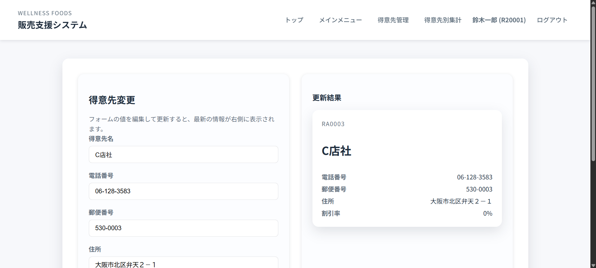
2. 右側の更新結果カードで最新情報を確認できます。別の得意先を編集したい場合は「別の得意先を選ぶ」を押します。

## 得意先削除
### 削除対象の選択
1. 「得意先削除」で一覧から削除したい得意先を選び、「削除する」をクリックします。
   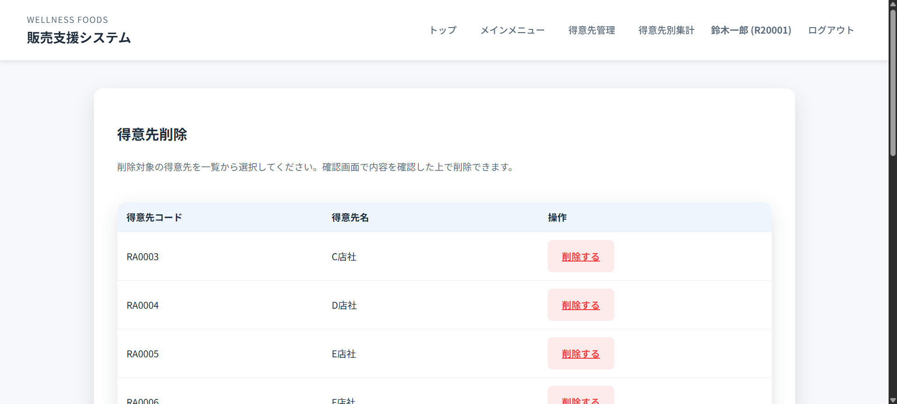

### 確認と削除実行
1. 確認画面で主要項目と警告メッセージを確認します。
   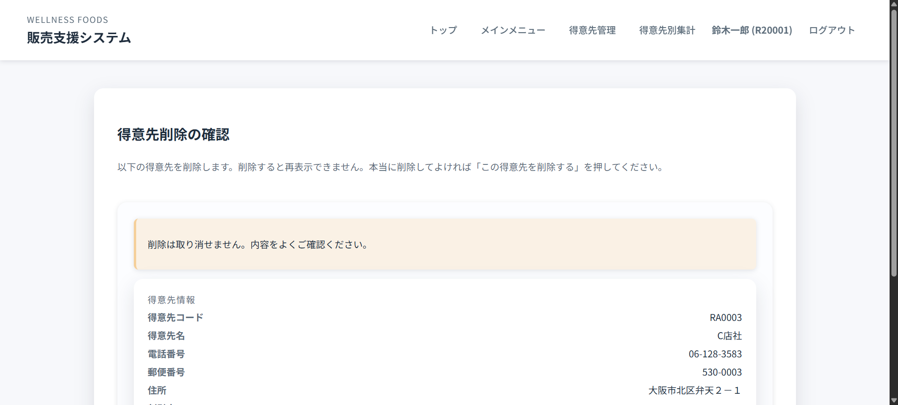
2. 「この得意先を削除する」を押すと即時に削除され、一覧へ戻ります。削除は取り消せないため十分に確認してください。

## 得意先一覧
1. 「得意先一覧」を開くと全件表が表示されます。
   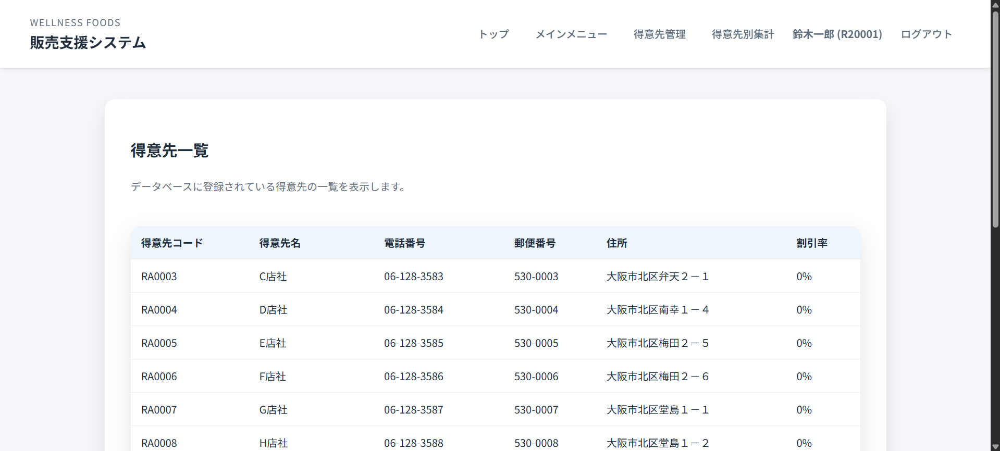
2. 割引率は値が設定されていない場合にハイフンで表示されます。出力をCSV化したい場合はブラウザの表コピー機能を利用してください。

## よくあるエラーと対処法
- **検索結果が0件**: コードの前後スペースを削除し、名称検索に切り替えてください。
- **登録時に「既に存在します」と表示**: 同じ電話番号が登録済みのケースです。実際に重複が許容されるか営業担当と確認してください。
- **削除対象が一覧に表示されない**: 削除済み、または無効化済みのレコードです。割引率の更新など別操作が必要ないか確認してください。
