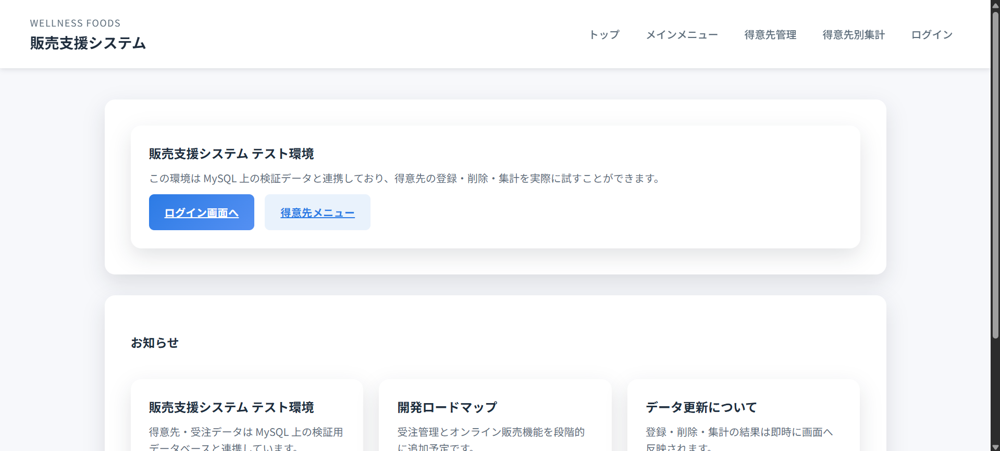
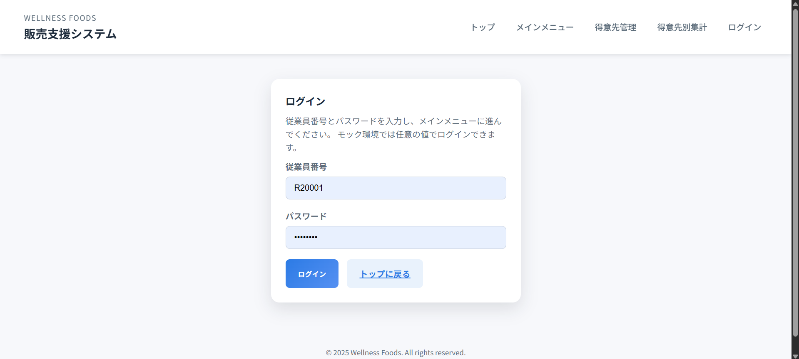

# ログイン手順

## 事前準備
- 従業員番号（6桁）と初期パスワードを準備します。初期パスワードはシステム管理者から共有されます。
- 推奨ブラウザは Google Chrome 最新版です。その他ブラウザを使用する場合は、表示崩れがないか確認してください。
- 社内ネットワークまたは VPN 経由で接続します。外出先からのアクセスには VPN 接続が必須です。

## ログイン手順

1. ログイン画面へ
     
   トップ画面の「ログイン画面へ」ボタンを押し、ログインフォームに移動します。
2. 認証情報を入力
     
   従業員番号とパスワードを入力し、ログインボタンを押します。
3. メインメニュー表示
     
   認証に成功するとメインメニューが表示され、得意先管理や得意先別集計へ遷移できます。
4. ログアウト後にログイン画面へ戻る
   メインメニュー右下の「ログアウト」を押すとセッションが終了し、ログイン画面へ戻ります。

## よくあるエラーと対処方法
- **従業員番号またはパスワードが違いますと表示される**: CapsLock がオンになっていないか確認し、再入力してください。入力欄の下にエラーメッセージが表示されます。
- **セッションが切れましたと表示される**: 長時間操作しなかった場合に表示されることがあります。再度ログインしてください。
- **画面が真っ白のままになる**: ブラウザのキャッシュをクリアするか、別ブラウザで再度アクセスしてください。それでも改善しない場合はネットワーク状態を確認します。
