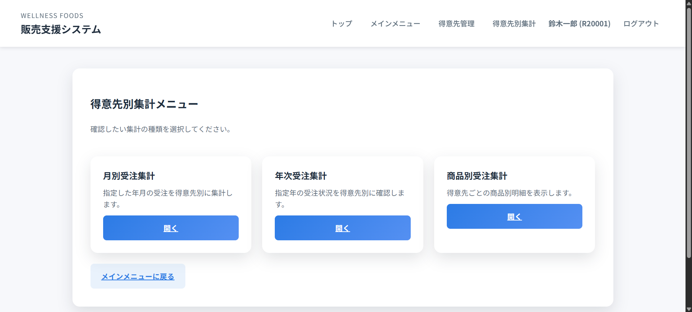
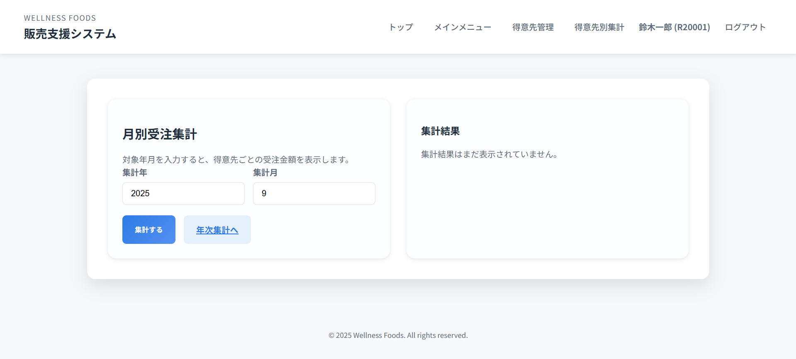
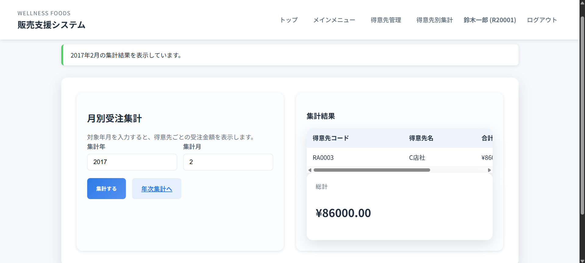
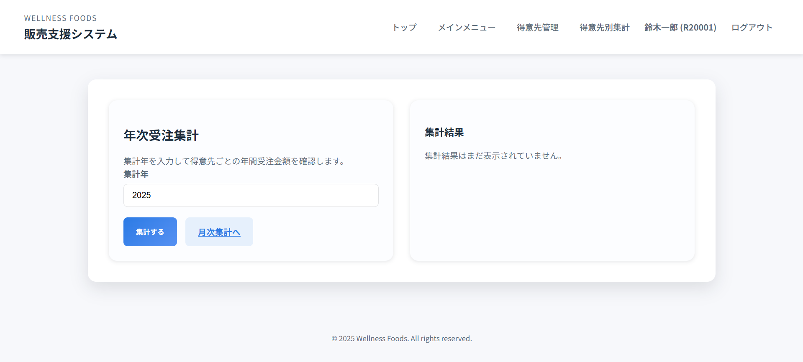
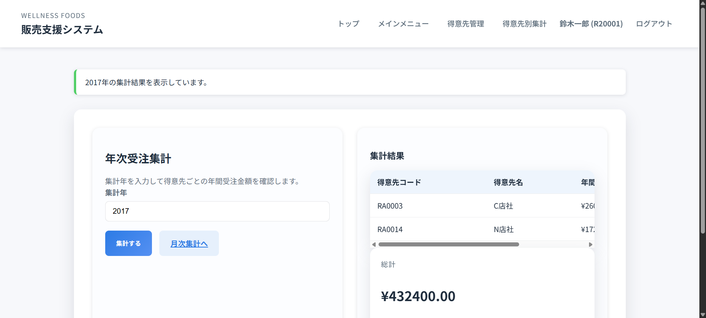
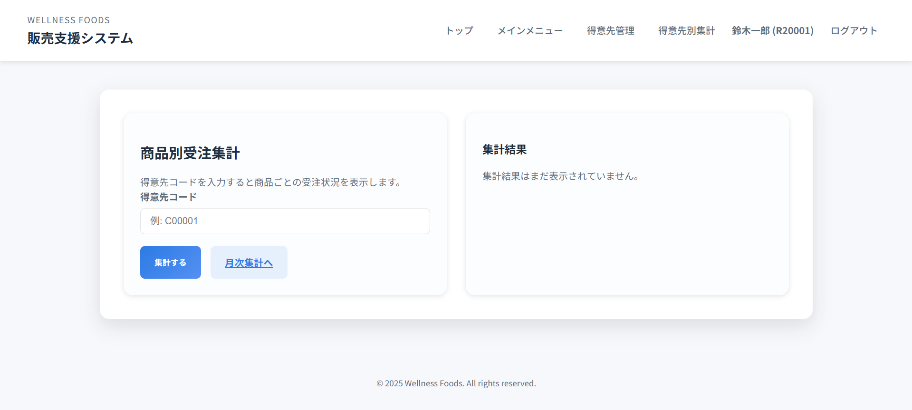
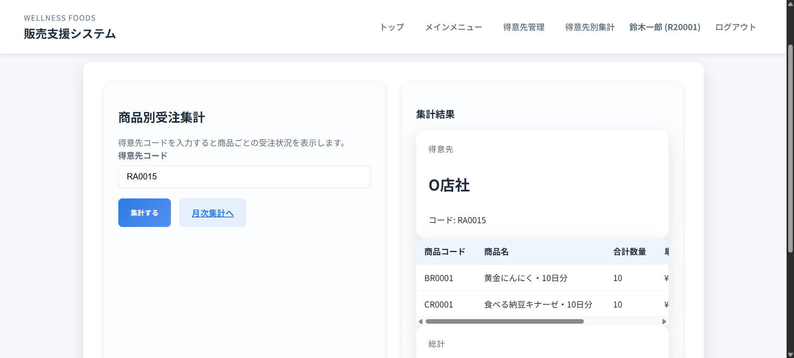

# 得意先別集計の操作手順

本ドキュメントでは、得意先別集計システムの月別・年次・商品別集計画面の操作手順を説明します。

## メインメニューからの導線
1. ログイン後のメインメニューで「得意先別集計」を選択します。
2. 得意先別集計メニュー画面が表示され、月次・年次・商品別の3つのカードが並びます。
3. 利用したい集計カードの「開く」ボタンを押すと、それぞれの集計画面に遷移します。
   

## 月別受注集計
### 手順
1. 集計したい年月を入力します（例: 2025年4月）。
   
2. 「集計する」を押すと得意先コードごとの合計金額が表示されます。
   

### 入力のポイント
- 月は 01〜12 の2桁で入力します。未入力の場合はエラーが表示されます。
- 集計結果が0件のときは「集計結果はまだ表示されていません。」と表示されます。期間条件を確認してください。

## 年次受注集計
### 手順
1. 年次受注集計画面で集計年を入力します。
   
2. 「集計する」を押すと、得意先ごとの年間合計(税込)が一覧と総計カードで表示されます。
   

### 入力のポイント
- 西暦4桁で入力します。未来年を指定すると集計対象が空になる場合があります。
- 一覧の金額は自動的に税込表示（¥記号付き）となります。

## 商品別受注集計
### 手順
1. 対象の得意先コードを入力します。
   
2. 「集計する」を押すと、指定した得意先に紐づく商品別の数量・単価・合計金額が表示されます。
   
3. 別の得意先を確認する場合はコードを変更して再集計します。

### 入力のポイント
- 得意先コードは6桁の英数字で、先頭のゼロも含めて入力してください。
- 結果一覧の上部に得意先名とコードが表示されます。想定外の得意先が表示された場合はコードを再確認してください。
- 集計結果がない場合は説明メッセージが表示されます。

## 共通の注意事項
- それぞれのフォームに入力後は必ず「集計する」ボタンを押してください。Enter キーのみでは送信されないブラウザがあります。
- 集計結果テーブルはブラウザのコピー機能でスプレッドシートへ貼り付けできます。書式が不要な場合はテキストとして貼り付けてください。
- 集計画面はセッションが切れると再ログインが必要です。長時間操作しない場合は、入力内容をスクリーンショットで保存してから離席すると安心です。
